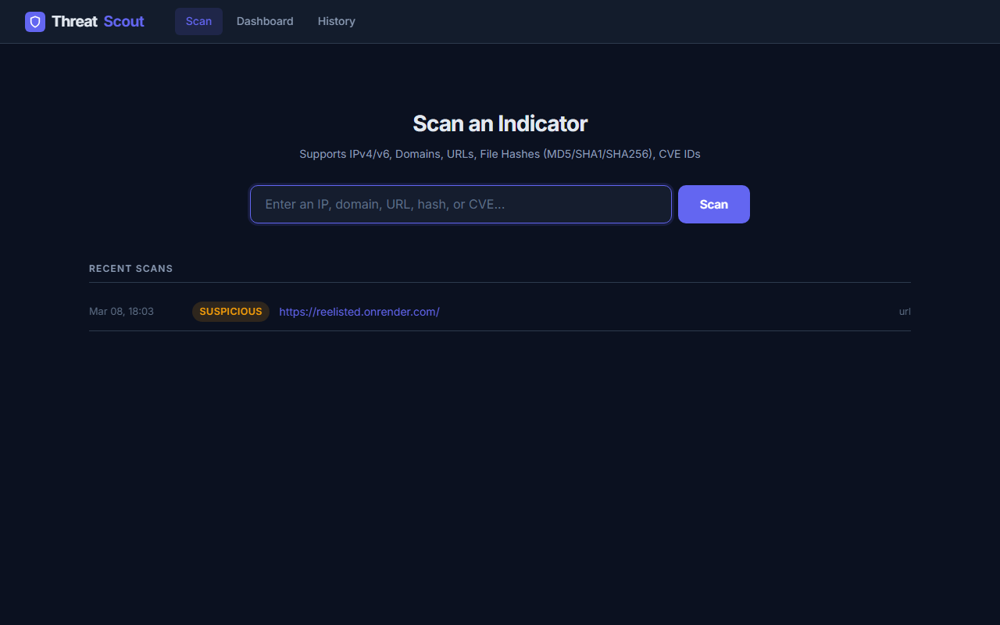
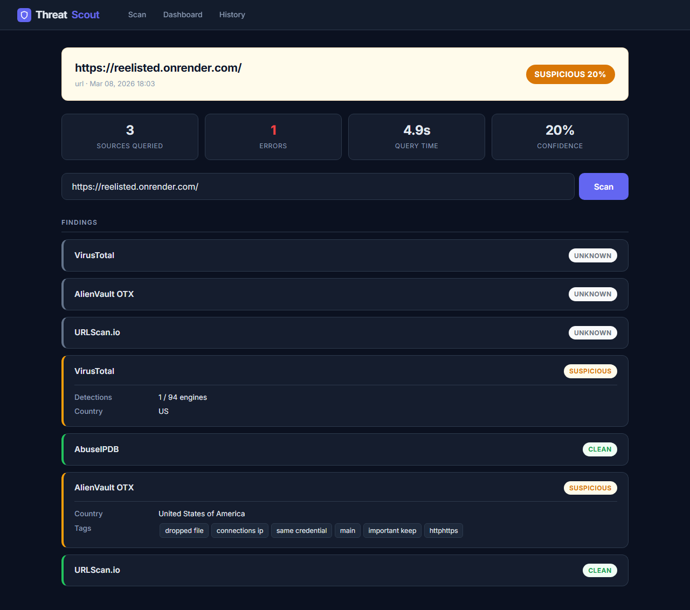
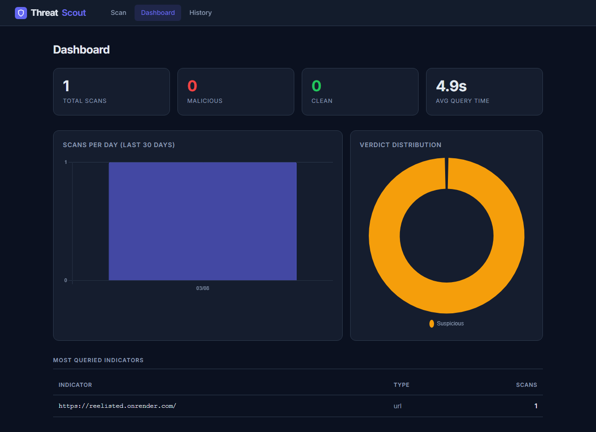
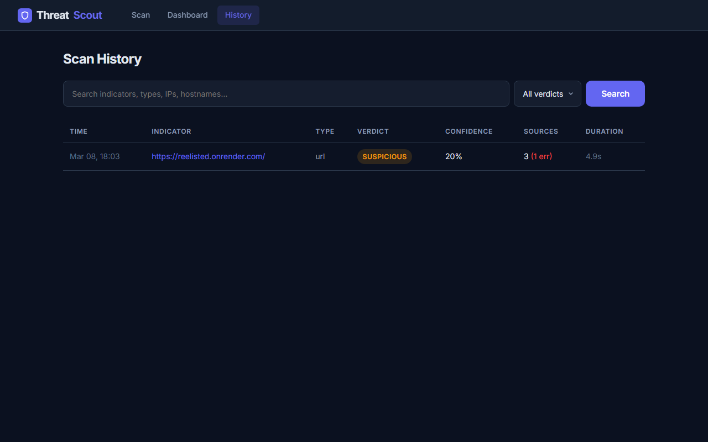

# threatscout

A threat intelligence tool that queries multiple free APIs simultaneously and returns a unified, enriched report on any indicator — IP address (IPv4/IPv6), domain, URL, file hash, or CVE.

| Scan | Report |
|------|--------|
|  |  |

| Dashboard | History |
|-----------|---------|
|  |  |

---

## Quick Start

**Prerequisites:** Python 3.10+

### 1. Install

```bash
git clone https://github.com/justin-pitt/threatscout.git
cd threatscout
pip install -e ".[web]"
```

### 2. Configure API Keys

```bash
cp .env.example .env
```

Edit `.env` and add your keys:

```env
# Required for full coverage
VIRUSTOTAL_API_KEY=your-key-here
ABUSEIPDB_API_KEY=your-key-here
OTX_API_KEY=your-key-here

# Optional — higher rate limit with key; works without one
NVD_API_KEY=your-key-here

# Optional — free community key
GREYNOISE_API_KEY=your-key-here

# Optional — paid plan
SHODAN_API_KEY=your-key-here
```

Several sources work without any key: MalwareBazaar, URLScan.io, WHOIS, and CISA KEV.

### 3. Set Up the Database

```bash
cd web
python manage.py migrate
```

### 4. Run the Server

```bash
python manage.py runserver
```

Open **http://localhost:8000** in your browser — that's it.

---

## What You Can Do

- **Scan** (`/`) — Enter any IP, domain, URL, file hash, or CVE. Results load asynchronously with a loading overlay.
- **Report** (`/report/<id>/`) — Detailed results with a verdict banner, summary stats, and collapsible per-source cards. Malicious/suspicious findings are expanded by default.
- **Dashboard** (`/dashboard/`) — Scan volume over time, verdict distribution, and top queried indicators.
- **History** (`/history/`) — Paginated scan history with full-text search and verdict filtering.

---

## Supported Sources

| Source | What It Provides | Indicator Types | Key Required |
|---|---|---|---|
| [VirusTotal](https://virustotal.com) | Malware scan results from 70+ AV engines | IP, domain, URL, hash | Free (4 req/min) |
| [AbuseIPDB](https://abuseipdb.com) | IP abuse reports and confidence score | IP | Free (1,000 req/day) |
| [AlienVault OTX](https://otx.alienvault.com) | Community threat pulses and IOC context | IP, domain, URL, hash | Free (no stated limit) |
| [NVD / NIST](https://nvd.nist.gov) | Official CVE database with CVSS scores | CVE | Optional (higher rate with key) |
| [CISA KEV](https://www.cisa.gov/known-exploited-vulnerabilities-catalog) | Known Exploited Vulnerabilities catalog | CVE | No key required |
| [MalwareBazaar](https://bazaar.abuse.ch) | Malware hash lookup with family and file type | Hash | No key required |
| [URLScan.io](https://urlscan.io) | URL/domain/IP scan history and malicious flags | IP, domain, URL | No key required |
| [WHOIS](https://pypi.org/project/python-whois/) | Domain registration age, registrar, nameservers | Domain | No key required |
| [GreyNoise](https://greynoise.io) | Internet background noise classification | IP | Free community key |
| [Shodan](https://shodan.io) | Open ports, exposed services, and known CVEs | IP | Paid key |

---

## Getting API Keys

- **VirusTotal** — [virustotal.com](https://www.virustotal.com/gui/join-us) → free: 4 req/min, 500/day
- **AbuseIPDB** — [abuseipdb.com](https://www.abuseipdb.com/register) → free: 1,000 req/day
- **AlienVault OTX** — [otx.alienvault.com](https://otx.alienvault.com/accounts/register) → free, no stated limit
- **NVD** — [nvd.nist.gov](https://nvd.nist.gov/developers/request-an-api-key) → free: 50 req/30s with key, 5 req/30s without
- **GreyNoise** — [viz.greynoise.io](https://viz.greynoise.io/signup) → free community key
- **Shodan** — [account.shodan.io](https://account.shodan.io) → paid plan required for host lookups

---

## DNS Enrichment

ThreatScout automatically enriches indicators in both directions:

- **Domain/URL → IP:** Resolves the domain to its IP and queries IP-based sources (AbuseIPDB, VirusTotal, etc.) against it.
- **IP → Hostname:** Performs a reverse DNS lookup and queries domain-based sources against the resolved hostname.

Enriched results appear in a separate labelled section of the report.

---

## Database

By default the web UI uses SQLite (`web/db.sqlite3`). For PostgreSQL, add these to `.env`:

```env
DJANGO_SECRET_KEY=your-secret-key
DB_ENGINE=django.db.backends.postgresql
DB_NAME=threatscout
DB_USER=your-user
DB_PASSWORD=your-password
DB_HOST=localhost
DB_PORT=5432
```

---

## REST API

A FastAPI-based API is also available for programmatic access.

```bash
uvicorn threatscout.api:app --reload
```

### `POST /scan`

```bash
curl -X POST http://localhost:8000/scan \
  -H "Content-Type: application/json" \
  -d '{"indicator": "198.51.100.42"}'
```

| Field | Type | Description |
|---|---|---|
| `indicator` | string (required) | The value to scan |
| `indicator_type` | string or null | Explicit type: `ip`, `domain`, `url`, `hash`, `cve`. Omit to auto-detect. |
| `sources` | list or null | Only query these sources. Omit to use all. |
| `exclude` | list or null | Skip these sources. |

### `GET /health`

Returns API status and the number of loaded sources.

Interactive docs at `http://localhost:8000/docs`. See [`examples/api_example.py`](examples/api_example.py) for a Python example.

---

## CLI

ThreatScout also has a CLI for terminal-based usage:

```bash
# Auto-detect indicator type
threatscout scan 198.51.100.42

# Explicit type
threatscout ip 198.51.100.42
threatscout domain malicious-example.com
threatscout url "https://malicious-example.com/payload"
threatscout hash d41d8cd98f00b204e9800998ecf8427e
threatscout cve CVE-2021-44228

# Output as JSON or CSV
threatscout ip 198.51.100.42 --format json
threatscout ip 198.51.100.42 --format csv

# Save to file
threatscout ip 198.51.100.42 --output report.json

# Filter sources
threatscout ip 198.51.100.42 --sources virustotal,abuseipdb
threatscout ip 198.51.100.42 --exclude shodan,greynoise

# Minimum risk level
threatscout ip 198.51.100.42 --min-risk suspicious
```

---

## Running Tests

```bash
pip install -e ".[dev]"
pytest tests/ -v
```